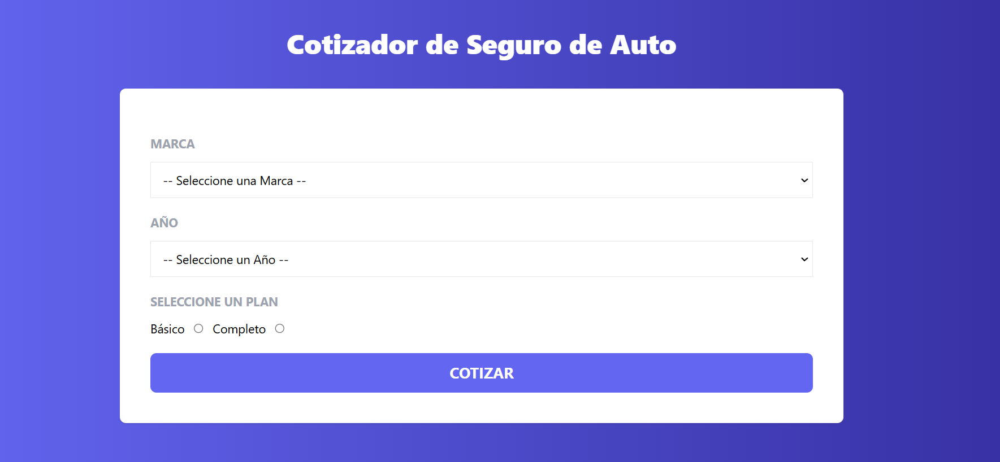

<!-- Banner -->


# 👋 ¡Hola gracias por visitar mi Proyecto!

## 🚀 Proyecto: Cotizador de Seguros

Este es el frontend de Cotizador de Seguros, una aplicación web diseñada para ayudar a los usuarios a cotizar seguros de manera rápida y eficiente. Con esta herramienta, puedes seleccionar diferentes parámetros, como tipo de seguro, cobertura y duración, y obtener una cotización personalizada.

## 🛠️ Tecnologías Utilizadas

- **React**: Librería para construir interfaces de usuario.
- **useContext**: Manejador de contexto para la gestión global de estados en la aplicación.
- **Tailwind CSS**: Framework de CSS para estilizar la aplicación.

## 🎥 Prueba la Aplicación

Puedes probar la aplicación en vivo visitando [este enlace en Netlify](https://tuenlace.netlify.app).

## 📝 Funcionalidades Principales

- **Selección de Parámetros**: Los usuarios pueden elegir el tipo de seguro, la cobertura deseada y el tipo de plan.
- **Cotización en Tiempo Real**: La aplicación muestra el precio estimado del seguro basado en los parámetros seleccionados.
- **Interfaz Intuitiva**: La aplicación está diseñada con una interfaz clara y fácil de usar, optimizada para una experiencia de usuario fluida.


## 📂 Estructura del Proyecto

```bash
src/
├── components/       # Componentes reutilizables
├── constants/        # Constantes
├── context/          # Configuración y manejo del contexto global con useContext
├── helpers/          # Funciones utilitarias y helpers
└── hooks/            # Hook personalizado para el manejo de useContext
```
## 🚀 Cómo Empezar
1. Clona el repositorio:

```bash
git clone https://github.com/RodrigoLoboDev/REST_API_FRONTEND-PRODUCTS
```
2. Instala las dependencias:

```bash
npm install
```

3. Inicia el servidor de desarrollo:

```bash
npm run dev
```

## 📸 Capturas de Pantalla


## 🤝 Contribuciones
Las contribuciones son bienvenidas. Si tienes ideas para mejorar el proyecto, no dudes en abrir un issue o hacer un pull request.

## 📧 Contacto
- Email: rolobo2812@gmail.com
- LinkedIn: [Jesús Luis Rodrigo Lobo](https://www.linkedin.com/in/jes%C3%BAs-luis-rodrigo-lobo-6594a81b4/)
- GitHub: [RodrigoLoboDev](https://github.com/RodrigoLoboDev)

#### ⭐️ Si te gusta lo que hago, no dudes en seguirme y contribuir a mis proyectos. ⭐️